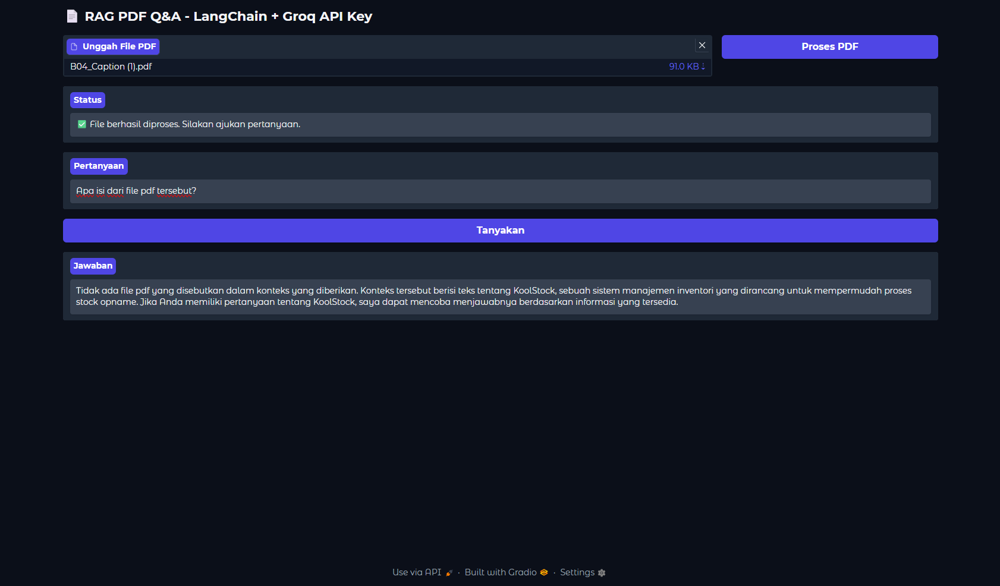
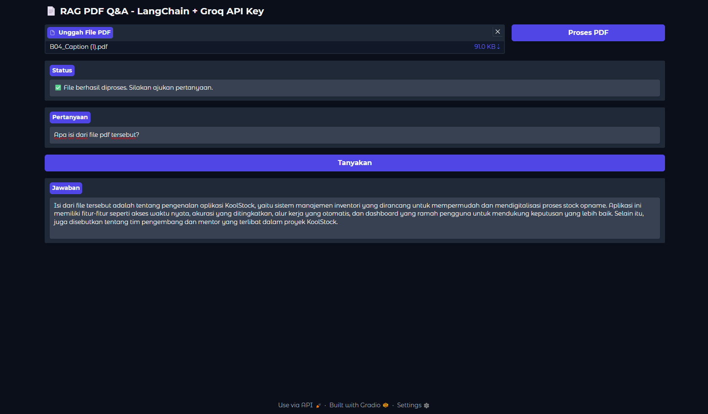
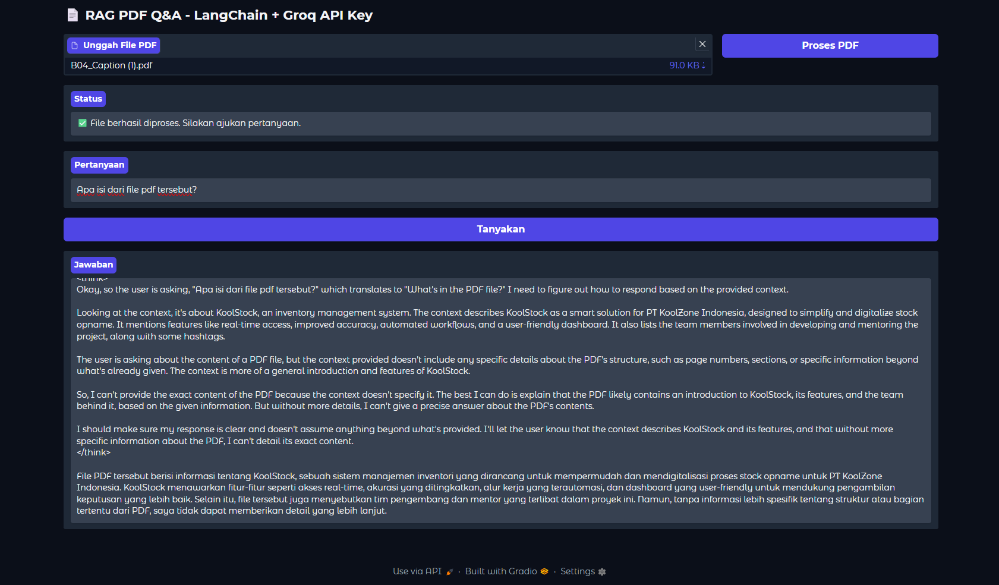
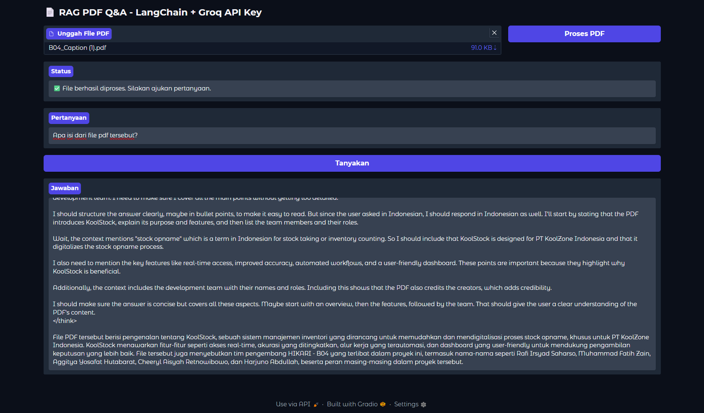
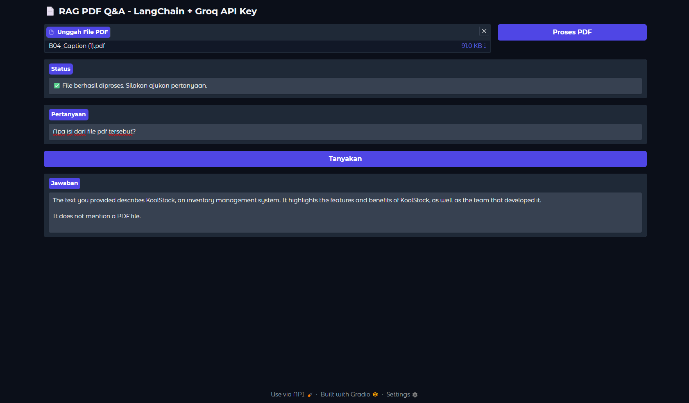
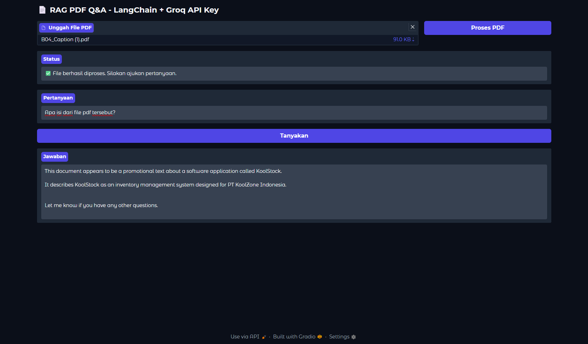

<h1 align="center"> Retrieval-Augmented Generation with Gradio and Groq API Key</h1>
<p align="center"> Natural Language Processing Project</p>

<div align="center">


</div>

### Name : Rafi Irsyad Saharso
### Tech Stack : Python, Gradio, LangChain, HuggingFace Embedding, FAISS vector store

---

### 1. Analysis about how the project works
This project is a Retrieval-Augmented Generation (RAG) application that leverages modern NLP tools and large language models to enable users to ask questions about the content of a PDF file. The workflow begins when a user uploads a PDF through the Gradio web interface. The PDF is processed using LangChain's `PyPDFLoader`, which extracts the text and splits it into manageable chunks using a text splitter. 

Each chunk is then embedded into a high-dimensional vector space using a HuggingFace embedding model (`sentence-transformers/all-MiniLM-L6-v2`). These embeddings are stored in a FAISS vector store, allowing for efficient similarity search. When a user submits a question, the system converts the question into an embedding and retrieves the most relevant chunks from the vector store based on semantic similarity.

The retrieved context, along with the user's question, is passed to a selected large language model (LLM) via the Groq API. The project supports several LLMs, such as `llama-3.3-70b-versatile`, `deepseek-r1-distill-llama-70b`, and `gemma2-9b-it`, and allows for easy switching between them as well as adjustment of the temperature parameter to control response diversity. The LLM synthesizes an answer using the retrieved context, and the result is displayed to the user in the Gradio interface.

This architecture combines the precision of retrieval-based methods with the flexibility of generative models, making it suitable for document-based question answering, summarization, and knowledge extraction. The modular design also enables experimentation with different models and settings to analyze their impact on answer quality.

For consistent model comparison, we used a standardized query:
> **"Apa isi dari file pdf tersebut?"**

Responses were collected across different temperature configurations for comprehensive analysis.

---

### 2. Analysis about how different every model works on Retrieval-Augmented Generation

```python
def get_llm():
    return ChatGroq(
        groq_api_key=GROQ_API_KEY,
        model_name="llama-3.3-70b-versatile", # Change the model in the code
        temperature=0.2
    )
```
- Model used : ```[llama-3.3-70b-versatile, deepseek-r1-distill-llama-70b, gemma2-9b-it]```

**2.1 Analysis on** ```llama-3.3-70b-versatile``` **:**

**Temperature: 0.2**


**Temperature: 0.8**


- The ```llama-3.3-70b-versatile``` model is a large language model with 70 billion parameters, designed for high accuracy and strong contextual understanding in various NLP tasks.
- In the context of Retrieval-Augmented Generation (RAG), this model excels at synthesizing information from retrieved documents, producing comprehensive and contextually relevant answers.
- When using a lower temperature (e.g., 0.2), the model tends to generate more deterministic, focused, and consistent answers, sticking closely to the retrieved context and minimizing randomness.
- At a higher temperature (e.g., 0.8), the model produces more diverse and creative responses, but may sometimes introduce less relevant or less factual information.
- In practice, with temperature 0.2, ```llama-3.3-70b-versatile``` is well-suited for tasks requiring accuracy and reliability, while temperature 0.8 can be useful for brainstorming or generating varied outputs.
- Overall, this model is highly capable for RAG scenarios, especially when precise and detailed answers are needed.


**2.2 Analysis on** ```deepseek-r1-distill-llama-70b``` **:** 

**Temperature: 0.2**


**Temperature: 0.8**


- The ```deepseek-r1-distill-llama-70b``` model is a distilled version of a large language model with 70 billion parameters, optimized for efficiency and faster inference while maintaining strong performance.
- In RAG scenarios, this model demonstrates good contextual understanding and is able to generate relevant answers based on retrieved documents.
- Compared to ```llama-3.3-70b-versatile```, the distilled model may produce slightly shorter or more concise answers, but still covers the main points from the context.
- At temperature 0.2, the model tends to provide focused and factual responses, closely following the retrieved information.
- At temperature 0.8, the model can generate more varied and creative outputs, but may sometimes include less relevant details or minor hallucinations.
- Overall, ```deepseek-r1-distill-llama-70b``` offers a good balance between speed and answer quality, making it suitable for RAG applications where efficiency is important but high answer quality is still required.


**2.3 Analysis on** ```gemma2-9b-it``` **:** 

**Temperature: 0.2**


**Temperature: 0.8**


- The ```gemma2-9b-it``` model is a smaller instruction-tuned language model with 9 billion parameters, designed for efficiency and fast inference while still providing reasonable language understanding.
- In RAG scenarios, this model is able to generate relevant answers based on retrieved documents, but its responses may be less detailed or comprehensive compared to larger models like ```llama-3.3-70b-versatile``` or ```deepseek-r1-distill-llama-70b```.
- At temperature 0.2, ```gemma2-9b-it``` produces concise and focused answers, closely following the retrieved context, but sometimes lacks depth or nuance in its explanations.
- At temperature 0.8, the model generates more varied and creative responses, but may introduce more irrelevant or less accurate information due to its smaller size and limited capacity.
- Overall, ```gemma2-9b-it``` is suitable for RAG applications where speed and resource efficiency are prioritized over answer depth and completeness. For more complex or detailed queries, larger models may provide better results.

---

### 3. Analysis about how temperature works

```python
def get_llm():
    return ChatGroq(
        groq_api_key=GROQ_API_KEY,
        model_name="llama-3.3-70b-versatile",
        temperature=0.2 # Change the temperature value here and analzye
    )
```

3.1 Analysis on higher temperature  
When the temperature is set higher (e.g., 0.8), the model generates responses that are more diverse and creative. This can be useful for brainstorming, generating multiple perspectives, or when a less rigid answer is desired. However, higher temperature also increases the risk of the model introducing irrelevant, less factual, or even hallucinated information. In RAG scenarios, this might lead to answers that are less grounded in the retrieved context and more speculative.

3.2 Analysis on lower temperature  
At lower temperature settings (e.g., 0.2), the model's output becomes more deterministic and focused. The responses are typically more concise, consistent, and closely tied to the retrieved context, making them more reliable for factual or context-sensitive tasks. This setting is ideal when accuracy and faithfulness to the source material are prioritized, as the model is less likely to generate unexpected or off-topic content.

---

### 4. How to run the project

Follow these steps to set up and run the project on your local machine:

1. **Clone the repository:**
   ```bash
   git clone https://github.com/arifian853/RAG_with_GroqAPI.git
   cd RAG_with_GroqAPI
   ```

2. **Copy the environment variable template and configure your API key:**
   - Duplicate the file `.env.example` and rename it to `.env`.
   - Open `.env` and set your Groq API Key:
     ```
     GROQ_API_KEY=your-groq-api-key
     ```
   - You can obtain your Groq API Key from: https://console.groq.com/keys

3. **Create and activate a virtual environment:**
   - On Windows:
     ```bash
     python -m venv venv
     .\venv\Scripts\activate
     ```
   - On Unix/MacOS:
     ```bash
     python3 -m venv venv
     source venv/bin/activate
     ```

4. **Install the required dependencies:**
   ```bash
   pip install -r requirements.txt
   ```

5. **Run the application:**
   ```bash
   python app.py
   ```

6. **Access the web interface:**
   - Open your browser and go to the URL displayed in the terminal (usually http://localhost:7860).

Now you can upload PDF files and interact with the RAG system through the Gradio interface!